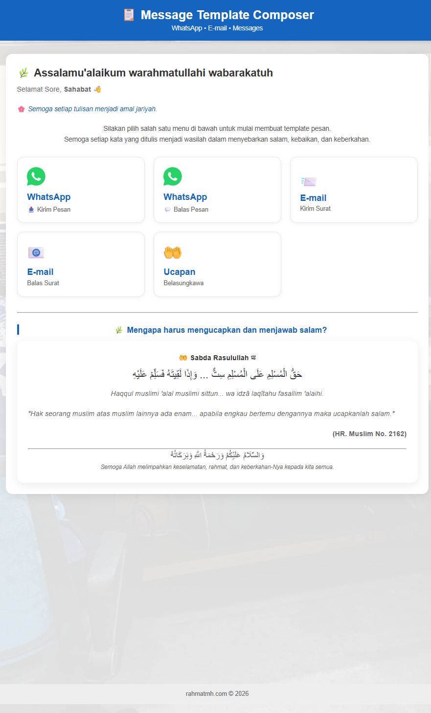
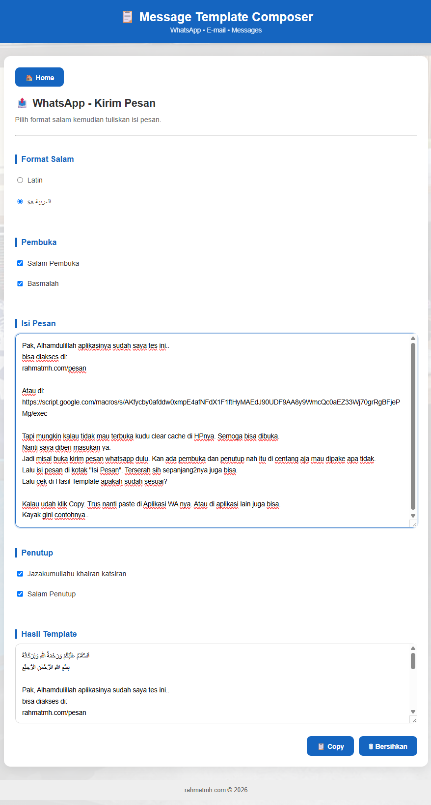
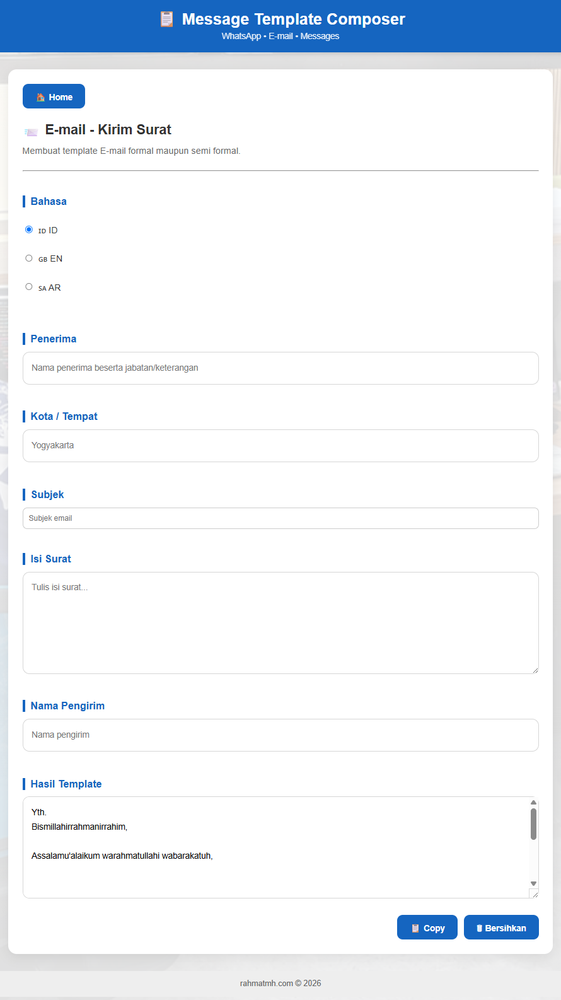
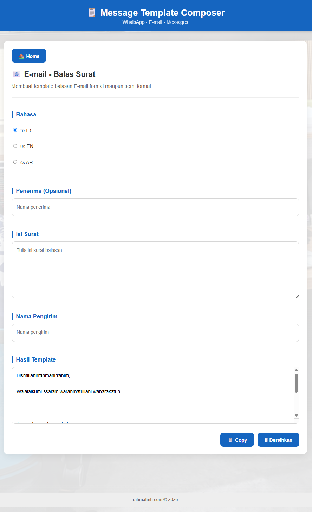
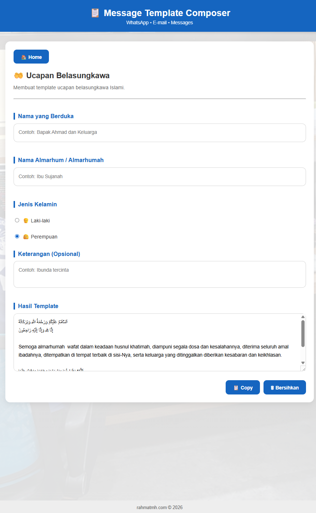

# 📋 Message Template Composer

A web-based **Message Template Composer** built with **Google Apps Script** to help users create professional message templates for WhatsApp, Email, and Islamic condolence messages.

---

## ✨ Features

- 📱 WhatsApp - Send Message
- 💬 WhatsApp - Reply Message
- 📧 E-mail - Send Message
- 📨 E-mail - Reply Message
- 🤲 Islamic Condolence Generator
- 🌿 Arabic & Latin Greeting Support
- 📋 One-click Copy to Clipboard
- 📖 Daily Islamic Reminder (Ayat & Hadith)
- 📱 Responsive Layout (Desktop & Mobile)

---

## 📸 Screenshots


<!--










-->

---

## 🛠 Built With

- Google Apps Script
- HTML5
- CSS3
- Vanilla JavaScript

---

## 🚀 Live Demo

Web App

> rahmatmh.com/pesan
> or 
> https://script.google.com/macros/s/AKfycbyJJN2IUrM-eP-dcGVcYPvWHtYiX5lqzr7Q6VmCFcB8oc2oHA1rv183c51ELN8ENyoF8w/exec

---

## 📂 Project Structure

```
Code.gs
Generator.html
Index.html
Pages.html
Router.html
Style.html
Templates.html
Version.html
```

---

## 👨‍💻 Author

**Rahmat Miftahul Habib**

🌐 https://rahmatmh.com

GitHub:
https://github.com/rahmatmh

---

⭐ If you find this project useful, consider giving it a **Star** on GitHub.
